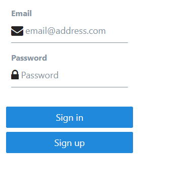
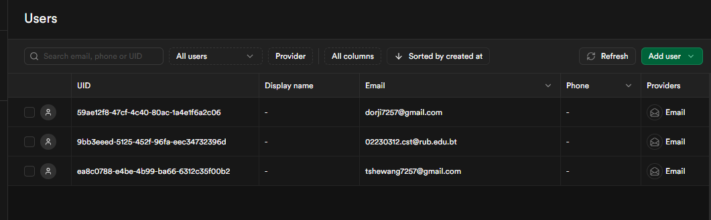

# Supabase Auth For Email And Password.

## 1. What I Have Done

In this project, I built a complete authentication and profile management system using **React Native** and **Supabase**. The main features include:

- **Authentication Flow**: Implemented sign-in and sign-up functionality using email and password.

- **Session Handling**: Added session persistence with `AsyncStorage` and Supabase's `onAuthStateChange`.

- **Auto Token Refresh**: Used `AppState` to start and stop Supabase’s auto-refresh based on app state.

- **Supabase Integration**: Connected the app to Supabase backend using secure environment variables.

---

## 2. What I Have Learnt

- How to integrate **Supabase** into a **React Native** app.

- How to manage authentication state and user sessions effectively.

- How to use `@react-native-async-storage/async-storage` for persistent session storage.

- Using **`useState`** and **`useEffect`** to manage app state and API calls.

- How to perform **CRUD operations** (read and update) with Supabase's `from()` and `upsert()`.

- Best practices for handling asynchronous functions and loading states in React Native.

- How to use **environment variables** in React Native for sensitive Supabase keys.

---

## 3. Challenges I Faced

### Setting Up Environment Variables
- Faced issues with accessing environment variables in the React Native environment.
- `process.env` was not returning the expected Supabase keys during runtime.

### AppState and Token Refresh
- Used `AppState.addEventListener()` outside of `useEffect`, which caused memory leaks and multiple event listeners to be attached.
- Auto-refresh did not behave as expected when switching app states (background → foreground).

---

## 4. How I Overcame Them

### Setting Up Environment Variables
- Ensured correct configuration by placing Supabase keys in `.env` and using `babel-plugin-dotenv` to load them properly in React Native.

### AppState and Token Refresh
- Moved the `AppState` event listener inside a `useEffect` hook with proper cleanup using `removeEventListener` to prevent memory leaks.

- Verified correct behavior of `startAutoRefresh()` and `stopAutoRefresh()` depending on the app state.

---

