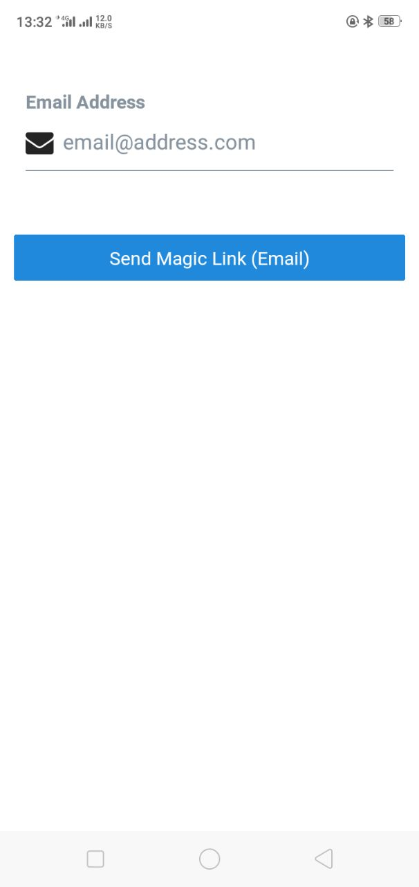
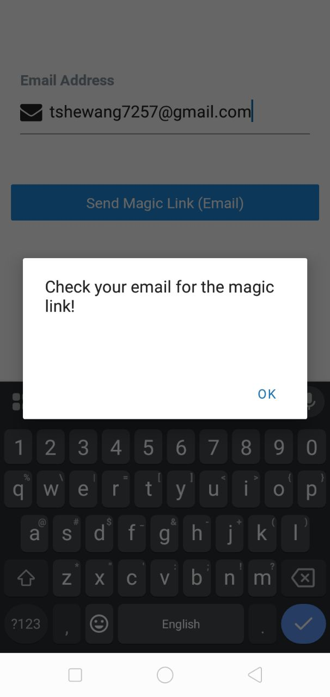
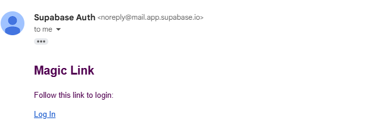

# Practical Report

## 1. What I Have Done

created a simple **login system using Supabase** in a **React Native app**.

### Features:
- A **login screen** where users can enter their email and receive a **magic link** to log in.

- A **profile page** where logged-in users can view and update their **username** and **website**.

- **Supabase** is used to handle user authentication and store profile data.

- The app keeps users **logged in** using persistent sessions.

- A **logout** option is available for users to sign out.

---

## 2. What I Have Learnt

- How to connect **Supabase with React Native and Expo**.

- How to send **magic links via email** using Supabase.

- How to **manage user sessions** (save, refresh, and detect sessions).

- How to **fetch and update data** from Supabase using `.select()` and `.upsert()`.

- How to use basic **navigation** and show alerts using `Alert`.

---

## 3. What Challenges I Have Faced

- The **user session** was not saved properly at first.
- **Redirect links** after login were not working sometimes.
- Profile data didn’t update immediately after saving.
- Sometimes, `session.user` was **undefined** at the start.

---

## 4. How Did I Overcome

- Used **AsyncStorage** to store the session for persistent login.
- Used `makeRedirectUri()` from **Expo Auth Session** to get the correct redirect link.
- Added **loading indicators** and `Alert.alert()` for better user experience.
- Ensured that `session.user.id` was available before fetching or updating data.

